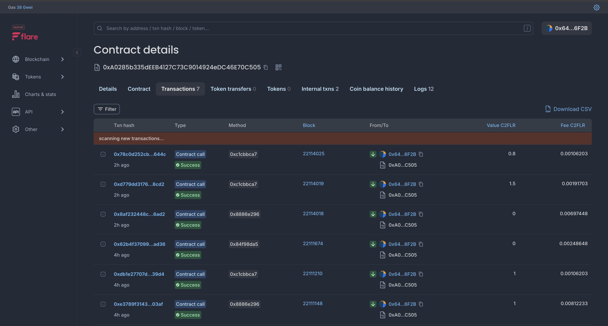
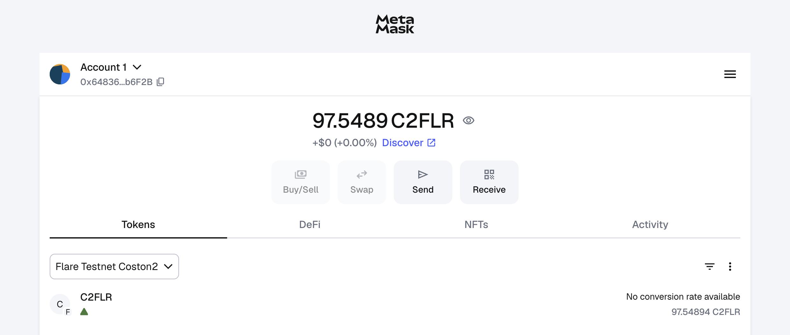

# 📖 Full Description

**FTG (Flare Travel Goals)** is a Web3-powered group travel savings and governance platform built on **Flare Network with XRPL integration**.
It solves a common problem: most trip ideas die in the group chat because no one commits money early, coordination is messy, and trust breaks down.

With FTG, friends pool funds into on-chain vaults, contribute consistently, and unlock money only when group approvals are met.
Funds are transparent, trustless, and governed directly in smart contracts.

🔑 How It Works
	1.	Create a Trip Pool (e.g., Hawaii 2025 with a $5,000 goal).
	2.	Invite Friends – connect Flare/XRPL wallets or join via link.
	3.	Set Contributions – weekly/monthly fixed amounts until the trip date.
	4.	Funds Locked On-Chain – escrow in Flare smart contracts with FTSO price monitoring.
	5.	Group Approvals – 75% quorum required to release/refund.
	6.	Exit Rules – members can leave only with full group consent.
	7.	Book When Ready – release funds to wallets or trigger booking flows.
	8.	XRPL Tokenization – travel shares issued as tradeable assets.
	9.	Oracle-Driven Timing – FTSO data determines optimal booking moments.

This makes FTG the first trustless, social, and automated group travel savings app with **cross-chain DeFi capabilities**.


#### 🎥 Frontend Demo
**Watch the Live Demo:** https://youtube.com/shorts/ru1R06pJ9tw?feature=share

#### 🎨 Design & Presentation
**Canva Presentation:** https://www.canva.com/design/DAGyQHL0fP4/09nrU-Vbp6IPNFAdxysi-A/edit

#### Backend Demo 
**Integrated Flare and XRPL:** https://youtu.be/3NCm_38DRGM

#### 📸 Screenshots

<div align="center">

**FTG Interface Demo:**



**FTG Application Preview:**



</div>


# ⚙️ Technical Description (XRPL + Flare)

OGC leverages Flare’s EVM (for rich smart-contract logic + on-chain data) and XRPL (for ultra-low-fee payments & trustlines) to make group savings practical and scalable.
	•	Smart Contracts (Flare): Solidity vault + payout logic, deployed to Coston2 via Hardhat.
	•	On-chain Data (Flare): FTSO price feeds (e.g., USD/XRP) to keep goals/premiums stable in USD terms; optional State Connector/Web2JSON for verified external events.
	•	XRPL Integration: Contributions/settlement on XRPL Testnet (Payments, Escrow, MultiSign) with an OGC Issued Currency (IOU) for points/receipts; optional FAssets/FXRP to mirror XRP on Flare for contract-driven accounting.
	•	Wallets: MetaMask (Flare EVM) + Xaman (XUMM)/GemWallet (XRPL).
	•	Fees: XRPL fees are fractions of a cent; Coston2 gas is minimal — ideal for micro-contributions.
	•	SDKs:
	•	Flare: Hardhat, ethers.js, TypeScript.
	•	XRPL: xrpl-py (Python) and/or xrpl.js.
	•	Indexing/Observability: XRPL Data API for account/tx scans; Flare RPC + event logs (ethers.js) for contract events.

# Flare Hardhat Starter Kit

This is a starter kit for interacting with Flare blockchain.
It provides example code for interacting with enshrined Flare protocol, and useful deployed contracts.
It also demonstrates, how the official Flare smart contract periphery [package](https://www.npmjs.com/package/@flarenetwork/flare-periphery-contracts) can be used in your projects.

## Getting started

If you are new to Hardhat please check the [Hardhat getting started doc](https://hardhat.org/hardhat-runner/docs/getting-started#overview)

1. Clone and install dependencies:

    ```console
    git clone https://github.com/flare-foundation/flare-hardhat-starter.git
    cd flare-hardhat-starter
    ```

    and then run:

    ```console
    yarn
    ```

    or

    ```console
    npm install --force
    ```

2. Set up `.env` file

    ```console
    cp .env.example .env
    ```

3. **IMPORTANT: Configure Your Wallet**

    Open the `.env` file and replace the placeholder with your actual private key:

    ```env
    PRIVATE_KEY=your_actual_private_key_here_without_0x_prefix
    FLARE_RPC_URL=https://coston2-api.flare.network/ext/bc/C/rpc
    ```

    **⚠️ Security Notes:**
    - Never share your private key or commit it to version control
    - Use a test wallet for development (not your main wallet)
    - Get Coston2 testnet tokens from [Flare Faucet](https://faucet.flare.network/coston2)
    - Your wallet needs Coston2 ETH to run the FTG demo scripts

4. Change the `PRIVATE_KEY` in the `.env` file to yours

5. Compile the project

    ```console
    yarn hardhat compile
    ```

    or

    ```console
    npx hardhat compile
    ```

    This will compile all `.sol` files in your `/contracts` folder.
    It will also generate artifacts that will be needed for testing.
    Contracts `Imports.sol` import MockContracts and Flare related mocks, thus enabling mocking of the contracts from typescript.

6. Run Tests

    ```console
    yarn hardhat test
    ```

    or

    ```console
    npx hardhat test
    ```

7. Deploy

    Check the `hardhat.config.ts` file, where you define which networks you want to interact with.
    Flare mainnet & test network details are already added in that file.

    Make sure that you have added API Keys in the `.env` file

    ```console
    npx hardhat run scripts/tryDeployment.ts
    ```

## 🎯 FTG - Flare Travel Goals Demo Commands

**Revolutionary Cross-Chain DeFi Solution for Group Travel Planning**

After setting up the project, you can run the following FTG demo scripts:

### Live Demo Commands (Copy & Paste Ready)

```bash
# 1. Contract Status Check - View live contract balance and vault status
npx hardhat run scripts/checkFTGBalance.ts --network coston2

# 2. Main Demo - FTSO Integration & Smart Travel Vaults
npx hardhat run scripts/FTG_hackathon_demo.ts --network coston2

# 3. Cross-Chain Integration - XRPL Asset Issuance & Bridge
npx hardhat run scripts/xrpl-integration/FTG_CompleteDemo.ts --network coston2

# 4. Live Financial Operations - Add funds and demonstrate transactions
npx hardhat run scripts/addMoreFunds.ts --network coston2

# 5. Emergency Backup Demo - Quick presentation fallback
npx hardhat run scripts/emergencyDemo.ts --network coston2
```

### Pre-Presentation Validation

```bash
# Test everything before your demo/presentation
npx hardhat run scripts/prePresentation_validation.ts --network coston2
```

### 🌟 What is FTG?

FTG combines **XRPL's asset issuance and liquidity** with **Flare's decentralized data and proofs** to create:

- 🔮 **Oracle-Driven Timing**: FTSO price feeds determine optimal booking moments
- 🪙 **Tokenized Travel Shares**: XRPL assets representing vault ownership  
- 💰 **Advanced DeFi**: Lending/borrowing against travel funds
- 🗳️ **Democratic Governance**: Group voting for trip decisions
- 🛡️ **Emergency Protection**: Multi-layered fund safety mechanisms

## 📖 Further Description

**FTG (Flare Travel Goals)** is a Web3-powered group travel savings and governance platform built on Flare Network with XRPL integration. It solves a common problem: most trip ideas die in the group chat because no one commits money early, coordination is messy, and trust breaks down.

With FTG, friends pool funds into on-chain vaults, contribute consistently, and unlock money only when group approvals are met. Funds are transparent, trustless, and governed directly in smart contracts.

### 🔑 How It Works

1. **Create a Trip Pool** (e.g., Hawaii 2025 with a $5,000 goal)
2. **Invite Friends** – connect Flare wallets or join via link
3. **Set Contributions** – weekly fixed amounts until the trip date
4. **Funds Locked On-Chain** – escrow in Flare network with FTSO price monitoring
5. **Group Approvals** – 75% quorum required to release/refund
6. **Exit Rules** – members can leave only with full group consent
7. **Book When Ready** – release funds to wallets or trigger booking flows
8. **XRPL Integration** – tokenized travel shares for liquidity and trading
9. **Oracle-Driven Timing** – FTSO data determines optimal booking moments

This makes FTG the **first trustless, social, and automated group travel savings app** with cross-chain DeFi capabilities.

**Live Contract:** [0xA0285b335dEEB4127C73C9014924eDC46E70C505](https://coston2-explorer.flare.network/address/0xA0285b335dEEB4127C73C9014924eDC46E70C505)

#### 🎥 Frontend Demo
**Watch the Live Demo:** https://youtu.be/amuoYIogn-4

## ⚙️ Technical Description (XRPL + Flare)

FTG leverages **Flare's EVM** (for rich smart-contract logic + on-chain data) and **XRPL** (for ultra-low-fee payments & trustlines) to make group savings practical and scalable.

### 🏗️ Architecture Components:

- **Smart Contracts (Flare)**: Solidity vault + payout logic, deployed to Coston2 via Hardhat
- **On-chain Data (Flare)**: FTSO price feeds (e.g., USD/XRP) to keep goals/premiums stable in USD terms; optional State Connector/Web2JSON for verified external events
- **XRPL Integration**: Contributions/settlement on XRPL Testnet (Payments, Escrow, MultiSign) with an FTG Issued Currency (IOU) for points/receipts; optional FAssets/FXRP to mirror XRP on Flare for contract-driven accounting
- **Wallets**: MetaMask (Flare EVM) + Xaman (XUMM)/GemWallet (XRPL)
- **Fees**: XRPL fees are fractions of a cent; Coston2 gas is minimal — ideal for micro-contributions

### 🛠️ Development Stack:

- **SDKs**:
  - **Flare**: Hardhat, ethers.js, TypeScript
  - **XRPL**: xrpl-py (Python) and/or xrpl.js
- **Indexing/Observability**: XRPL Data API for account/tx scans; Flare RPC + event logs (ethers.js) for contract events

---

## Repository structure

```
├── contracts: Solidity smart contracts
├── scripts: Typescript scripts that interact with the blockchain
├── test
├── hardhat.config.ts
├── package.json
├── README.md
├── tsconfig.json
└── yarn.lock
```

## Contributing

Before opening a pull request, lint and format the code.
You can do that by running the following commands.

```sh
yarn format:fix
```

```sh
yarn lint:fix
```

## Clean repository

If you want to start building your projects from a repository that is already setup to work with Flare correctly, but you do not want to keep any of the examples, these are the files you should delete:

- all files in the `contracts/` folder
- all files in the `scripts/` folder, except for the `scripts/fdcExample/Base.ts` which might come in useful

A shell command that does this is:

```sh
rm -rf contracts/* & mv scripts/fdcExample/Base.ts ./Base.ts & rm -rf scripts/* & mv ./Base.ts scripts/Base.ts
```

## Resources

- [Flare Developer Hub](https://dev.flare.network/)
- [Hardhat Guides](https://dev.flare.network/fdc/guides/hardhat)
- [Hardhat Docs](https://hardhat.org/docs)
